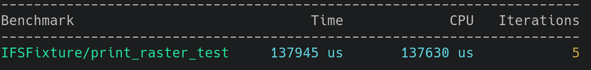
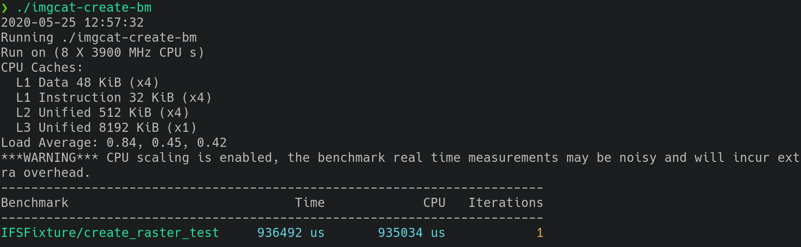
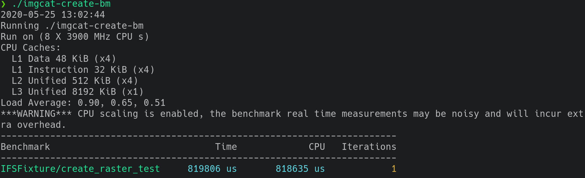
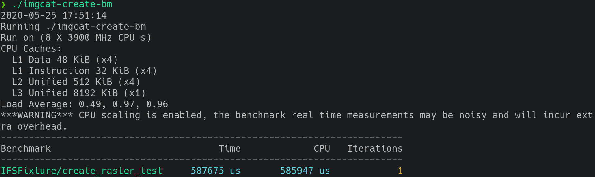
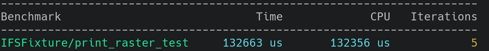

# Rapport HPC - Projet 1 - Imgcat

## Repo GIT

Voici le repo git du projet : [Github](https://github.com/gaeba95/imgcat)

Le code se trouve dans le dossier "code" et les sources du rapport dans "report".

### Dependencies

```
librairie libjpeg http://libjpeg.sourceforge.net/
librairie libpng http://www.libpng.org/pub/png/libpng.html
```

### Build

```bash
cd code/
./lib/setup.sh
make
```

### Test

```bash
Pour convertir une image en ASCII:
./imgcat images/half-life.png

Pour benchamrk la fonction create_raster_from_png:
./imgcat-create-bm

Pour benchmark la fonction print_raster:
./imgcat-bm
```

## Analyse des performances

### Perf

```bash
❯ sudo perf report --stdio --dsos=imgcat
# To display the perf.data header info, please use --header/--header-only options.
#
# dso: imgcat
#
# Total Lost Samples: 0
#
# Samples: 3K of event 'cpu-clock'
# Event count (approx.): 788500000
#
# Overhead  Command  Symbol                    
# ........  .......  ..........................
#
    17.95%  imgcat   [.] print_raster
    14.27%  imgcat   [.] create_raster_from_png


# Samples: 1K of event 'faults'
# Event count (approx.): 49333
#
# Overhead  Command  Symbol                    
# ........  .......  ..........................
#
    41.29%  imgcat   [.] create_raster_from_png


#
# (Tip: Show current config key-value pairs: perf config --list)
#
```

#### Create_raster_from_png

```c
perf annotate --stdio -l --dsos=imgcat --symbol=create_raster_from_png

   alpha = row_pointers[y][x*4 + 3] / 256.0;
    8.00 :   401fe8: cvtsi2sd %r10d,%xmm0
   raster->pixels[y][x].r = (alpha * row_pointers[y][x*4]) + 
                            ((1 - alpha) * 255);
    0.94 :   401fed: movzbl -0x4(%rdx),%r10d
    0.00 :   401ff2: cvtsi2ss %r10d,%xmm1
   alpha = row_pointers[y][x*4 + 3] / 256.0;
    0.00 :   401ff7: mulsd  %xmm5,%xmm0
    0.00 :   401ffb: cvtsd2ss %xmm0,%xmm0
   raster->pixels[y][x].r = (alpha * row_pointers[y][x*4]) + 
                            ((1 - alpha) * 255);
    7.29 :   401fff: subss  %xmm0,%xmm2
    1.18 :   402003: mulss  %xmm0,%xmm1
    0.00 :   402007: mulss  %xmm3,%xmm2
    0.47 :   40200b: addss  %xmm2,%xmm1
   11.06 :   40200f: cvttss2si %xmm1,%r10d
   raster->pixels[y][x].g = (alpha * row_pointers[y][x*4 + 1]) + 
                            ((1 - alpha) * 255);
   29.65 :   402014: pxor   %xmm1,%xmm1
   raster->pixels[y][x].r = (alpha * row_pointers[y][x*4]) + 
                            ((1 - alpha) * 255);
    0.94 :   402018: mov    %r10b,-0x3(%rax)
   raster->pixels[y][x].g = (alpha * row_pointers[y][x*4 + 1]) + 
                            ((1 - alpha) * 255);
   16.00 :   40201c: movzbl -0x3(%rdx),%r10d
    0.00 :   402021: cvtsi2ss %r10d,%xmm1
    0.00 :   402026: mulss  %xmm0,%xmm1
    0.24 :   40202a: addss  %xmm2,%xmm1
    0.00 :   40202e: cvttss2si %xmm1,%r10d
   raster->pixels[y][x].b = (alpha * row_pointers[y][x*4 + 2]) + 
                            ((1 - alpha) * 255);
    0.24 :   402033: pxor   %xmm1,%xmm1
   raster->pixels[y][x].g = (alpha * row_pointers[y][x*4 + 1]) + 
                            ((1 - alpha) * 255);
    7.29 :   402037: mov    %r10b,-0x2(%rax)
   raster->pixels[y][x].b = (alpha * row_pointers[y][x*4 + 2]) + 
                            ((1 - alpha) * 255);
    1.18 :   40203b: movzbl -0x2(%rdx),%r10d
    0.00 :   402040: cvtsi2ss %r10d,%xmm1
    0.24 :   402045: mulss  %xmm1,%xmm0
    0.24 :   402049: addss  %xmm2,%xmm0
    0.00 :   40204d: cvttss2si %xmm0,%r10d
   12.24 :   402052: mov    %r10b,-0x1(%rax)
   for (x = 0; x < width; ++x) {
    2.12 :   402056: cmp    %rcx,%rax
    0.00 :   402059: jne    401fd0 <create_raster_from_png+0x210>
   for (y = 0; y < height; ++y) {
    0.00 :   40205f: add    $0x8,%rsi
    0.00 :   402063: cmp    %rsi,%rdi
    0.00 :   402066: jne    401fb0 <create_raster_from_png+0x1f0>
```

```c
for (y = 0; y < height; ++y) {
    for (x = 0; x < width; ++x) {
      //Do alpha correction so that higher alpha values make the image more white
      alpha = row_pointers[y][x*4 + 3] / 256.0;
      raster->pixels[y][x].r = (alpha * row_pointers[y][x*4]) + ((1 - alpha) * 255);
      raster->pixels[y][x].g = (alpha * row_pointers[y][x*4 + 1]) + ((1 - alpha) * 255);
      raster->pixels[y][x].b = (alpha * row_pointers[y][x*4 + 2]) + ((1 - alpha) * 255);
    }
  }
```

On peut aisément voir que le point critique de cette fonction est lorsque l'on crée le raster en parcourant l'image.

#### Print_raster

```c
perf annotate --stdio -l --dsos=imgcat --symbol=print_raster

   intensity += (0.21 * pixel->r) + (0.72 * pixel->g) + (0.07 * pixel->b);
    0.00 :   4017e0: movzbl (%rax),%r10d
    2.33 :   4017e4: pxor   %xmm2,%xmm2
    8.23 :   4017e8: pxor   %xmm0,%xmm0
   intensity_count++;
    0.00 :   4017ec: add    $0x1,%edx
   intensity += (0.21 * pixel->r) + (0.72 * pixel->g) + (0.07 * pixel->b);
    0.00 :   4017ef: cvtss2sd %xmm3,%xmm3
   for (i = (int)(ratio_x * x); i < ratio_x * (x+1); ++i) {
   27.01 :   4017f3: add    $0x3,%rax
   intensity += (0.21 * pixel->r) + (0.72 * pixel->g) + (0.07 * pixel->b);
    0.00 :   4017f7: cvtsi2sd %r10d,%xmm2
   0.00 :   4017fc: movzbl -0x2(%rax),%r10d
    1.25 :   401801: cvtsi2sd %r10d,%xmm0
    0.00 :   401806: movzbl -0x1(%rax),%r10d
    0.36 :   40180b: mulsd  %xmm5,%xmm2
    7.69 :   40180f: mulsd  %xmm8,%xmm0
    0.18 :   401814: movapd %xmm2,%xmm1
    0.18 :   401818: addsd  %xmm0,%xmm1
    0.36 :   40181c: pxor   %xmm0,%xmm0
    0.00 :   401820: cvtsi2sd %r10d,%xmm0
   for (i = (int)(ratio_x * x); i < ratio_x * (x+1); ++i) {
    0.00 :   401825: lea    (%rdx,%rsi,1),%r10d
    0.00 :   401829: sub    %ecx,%r10d
   intensity += (0.21 * pixel->r) + (0.72 * pixel->g) + (0.07 * pixel->b);
    7.87 :   40182c: mulsd  %xmm7,%xmm0
    0.00 :   401830: addsd  %xmm1,%xmm0
    0.00 :   401834: addsd  %xmm0,%xmm3
   for (i = (int)(ratio_x * x); i < ratio_x * (x+1); ++i) {
   11.45 :   401838: pxor   %xmm0,%xmm0
    0.36 :   40183c: cvtsi2ss %r10d,%xmm0
   intensity += (0.21 * pixel->r) + (0.72 * pixel->g) + (0.07 * pixel->b);
    0.00 :   401841: cvtsd2ss %xmm3,%xmm3
   for (i = (int)(ratio_x * x); i < ratio_x * (x+1); ++i) {
   32.56 :   401845: comiss %xmm0,%xmm6
    0.00 :   401848: ja     4017e0 <print_raster+0x130>
```

```c
for (y = 0; y < print_height; ++y) {
    for (x = 0; x < print_width; ++x) {
      intensity = 0;
      intensity_count = 0;
      for (j = (int)(ratio_y * y); j < ratio_y * (y+1); ++j) {
          for (i = (int)(ratio_x * x); i < ratio_x * (x+1); ++i) {
            pixel = &raster->pixels[j][i];
            intensity += (0.21 * pixel->r) + (0.72 * pixel->g) + (0.07 * pixel->b);
            intensity_count++;
          }
      }
      intensity /= intensity_count;
      printf("%c", ascii_chars[(int)(num_ascii_chars * intensity / 256)]);
    }
```

On peut voir que le point critique est cette partie de code et plus précisément les deux boucles for qui se font à chaque pixel.

### Google Benchmark

#### Create_raster


#### Print_raster



## Optimisation

### Create_raster

#### SIMD

```c
__m128 x_real = _mm_set1_ps(0.0f);
  int index = 0;
  __m128 alpha_x = _mm_set1_ps(0.0f);
  __m128 r_x = _mm_set1_ps(0.0f);
  __m128 g_x = _mm_set1_ps(0.0f);
  __m128 b_x = _mm_set1_ps(0.0f);
  __m128 index_x = _mm_set1_ps(0.0f);
  raster = create_raster(width, height);
  for (y = 0; y < height; ++y) {
    for (x = 0; x < width; x += 4) {
      x_real = _mm_set_ps(x,x+1,x+2,x+3);
      x_real = _mm_mul_ps(x_real, _mm_set1_ps(4));
      //Do alpha correction so that higher alpha values make the image more white
      //alpha = row_pointers[y][x_real + 3] / 256.0;
      alpha_x = _mm_set_ps(row_pointers[y][(int)x_real[0] + 3],row_pointers[y][(int)x_real[1] + 3],row_pointers[y][(int)x_real[2] + 3],row_pointers[y][(int)x_real[3] + 3]);
      alpha_x = _mm_div_ps(alpha_x, _mm_set1_ps(256));
      index_x = _mm_sub_ps(_mm_set1_ps(1),alpha_x);
      index_x = _mm_mul_ps(index_x,_mm_set1_ps(255));
      r_x = _mm_add_ps(_mm_mul_ps(alpha_x, _mm_set_ps(row_pointers[y][(int)x_real[0]],row_pointers[y][(int)x_real[1]],row_pointers[y][(int)x_real[2]],row_pointers[y][(int)x_real[3]])),index_x);
      g_x = _mm_add_ps(_mm_mul_ps(alpha_x, _mm_set_ps(row_pointers[y][(int)x_real[0] + 1],row_pointers[y][(int)x_real[1] + 1],row_pointers[y][(int)x_real[2] + 1],row_pointers[y][(int)x_real[3] + 1])),index_x);
      b_x = _mm_add_ps(_mm_mul_ps(alpha_x, _mm_set_ps(row_pointers[y][(int)x_real[0] + 2],row_pointers[y][(int)x_real[1] + 2],row_pointers[y][(int)x_real[2] + 2],row_pointers[y][(int)x_real[3] + 2])),index_x);
      for(int i = 0; i < 4; i++){
          raster->pixels[y][x+i].r = r_x[i];
          raster->pixels[y][x+i].g = g_x[i];
          raster->pixels[y][x+i].b = b_x[i];
      }
    }
```



On peut voir que le temps est plus long qu'avec la version de base. Ce n'est donc pas une bonne optimisation.

#### Calcul préliminaire

J'ai essayé de faire les calculs avant de les utiliser pour ne pas les faire à chaque opération.

```c
  int x_real = 0;
  int index = 0;
  raster = create_raster(width, height);
  for (y = 0; y < height; ++y) {
    for (x = 0; x < width; ++x) {
      x_real = x*4;
      //Do alpha correction so that higher alpha values make the image more white
      //alpha = row_pointers[y][x_real + 3] / 256.0;
      alpha = row_pointers[y][x_real + 3] / 256.0;
      index = index = ((1 - alpha) * 255);
      raster->pixels[y][x].r = (alpha * row_pointers[y][x_real]) + index;
      raster->pixels[y][x].g = (alpha * row_pointers[y][x_real + 1]) + index;
      raster->pixels[y][x].b = (alpha * row_pointers[y][x_real + 2]) + index;
    }
  }
```



On peut noter une petite amélioration de environ 30000 us. Ce qui donne une diminution du temps de 3-4%.

#### Valeur constante pour alpha

Une optimisation possible est de ne pas calculer alpha pour chaque pixel mais de le mettre constante au début de la fonction. Cela permettrai de s'affranchir de beaucoup de calcul. Cependant je ne pense pas le faire car le résultat de l'image obtenu sera différents. Mais je pense néanmoins que cela pourrait être un sujet de discussion car le but du programme est de permettre d'afficher une image dans le terminal sous forme ASCII et non d'avoir un résultat d'image parfait. 

#### OpenMP

J'ai utilisé OpenMP sur les boucles problématiques.

```c
#pragma omp parallel for collapse(2) private(y,x,x_real,alpha,index)
    for (y = 0; y < height; ++y) {
      for (x = 0; x < width; ++x) {
        x_real = x*4;
        //Do alpha correction so that higher alpha values make the image more white
        //alpha = row_pointers[y][x_real + 3] / 256.0;
          alpha = row_pointers[y][x_real + 3] / 256.0;
          index = ((1 - alpha) * 255);

          //printf("thread num %d\n", omp_get_thread_num());

        raster->pixels[y][x].r = (alpha * row_pointers[y][x_real]) + index;
        raster->pixels[y][x].g = (alpha * row_pointers[y][x_real + 1]) + index;
        raster->pixels[y][x].b = (alpha * row_pointers[y][x_real + 2]) + index;
      }
    }
```



On peut voir que cela apporte une amélioration notable. On a un gain d'environ 30%.

### Print_raster

#### OpenMP

Je n'ai malheureusement pas réussi à paramétrer correctement OpenMP pour ces boucles.

#### Calcul préliminaire

J'ai effectué certain calcul avant certaines boucles pour ne pas les recalculer à chaque itération.

```c
for (y = 0; y < print_height; ++y) {
    for (x = 0; x < print_width; ++x) {
      intensity = 0;
      intensity_count = 0;
      int len_j = ratio_y * (y+1);
      int len_i = ratio_x * (x+1);
      for (j = (int)(ratio_y * y); j < len_j; ++j) {
          for (i = (int)(ratio_x * x); i < len_i; ++i) {
            pixel = &raster->pixels[j][i];
            intensity += (0.21 * pixel->r) + (0.72 * pixel->g) + (0.07 * pixel->b);
            intensity_count++;
          }
      }
      intensity /= intensity_count;
      printf("%c", ascii_chars[(int)(num_ascii_chars * intensity / 256)]);
    }
    printf("\n");
  }
```



On peut voir que qu'il y a une petite amélioration. On a un gain d'environ 4%.

## Conclusion

On pu m'exercer à l'utilisation d'OpenMP et me rendre compte de sa complexité mais aussi de son utilité. C'est la plus grosse optimisation que j'ai pu mettre en place dans ce projet ce qui n'est pas rien. 

A noter aussi que je n'ai optimiser que la fonction faite pour les images PNG car utilisant celle-ci pour mes tests. Cela veut donc dire que l'utilisation d'autres types d'image ne sera pas optimisé.
